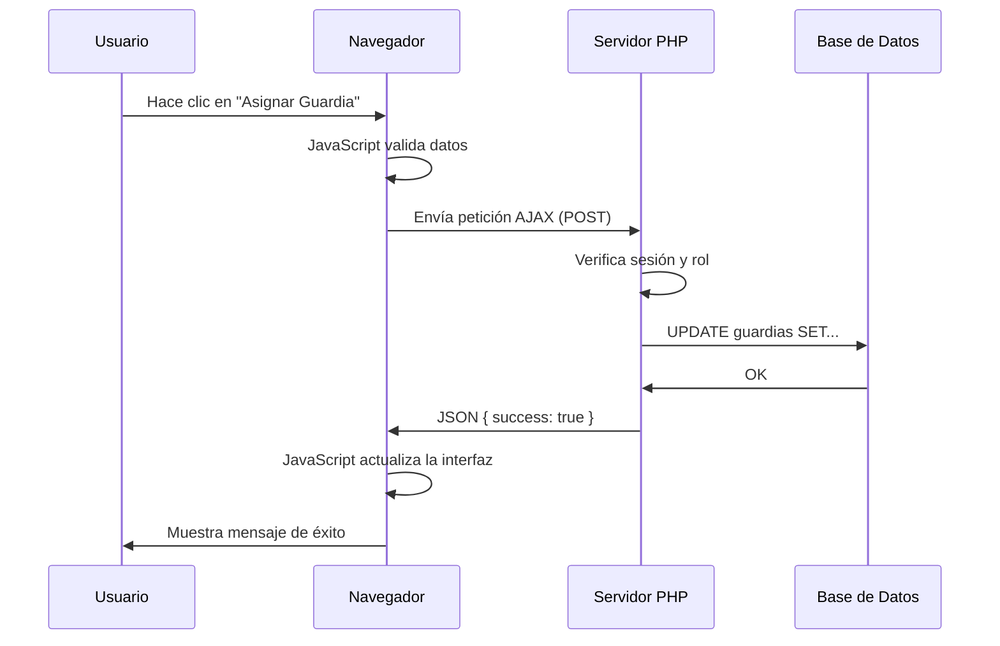

# 📚 Guía Completa del Sistema Guardianes

## Índice
1. [Conexión con la Base de Datos](#1-conexión-con-la-base-de-datos)
2. [Sistema de Autenticación y Sesiones](#2-sistema-de-autenticación-y-sesiones)
3. [Detección de Roles (Admin vs Profesor)](#3-detección-de-roles-admin-vs-profesor)
4. [Mostrar Contenido Según el Usuario](#4-mostrar-contenido-según-el-usuario)
5. [PHP vs JavaScript: ¿Cuándo usar cada uno?](#5-php-vs-javascript-cuándo-usar-cada-uno)

---

## 1. Conexión con la Base de Datos

### 📁 Archivos Involucrados
- [config.php](file:///c:/xampp/htdocs/Guardianes/config.php)
- [conexion.php](file:///c:/xampp/htdocs/Guardianes/conexion.php)

### 🔑 Paso a Paso

#### **Paso 1.1: Definir las credenciales** ([config.php](file:///c:/xampp/htdocs/Guardianes/config.php))

```php
<?php
// config.php
define('DB_HOST', 'localhost');  // Servidor de base de datos
define('DB_USER', 'root');        // Usuario de MySQL
define('DB_PASS', '');            // Contraseña (vacía en XAMPP por defecto)
define('DB_NAME', 'guardianes');  // Nombre de la base de datos
?>
```

**¿Qué hace?**
- Define **constantes** con los datos de conexión
- `define()` crea variables globales que no cambian
- Estas constantes se usan en `conexion.php`

---

#### **Paso 1.2: Crear la conexión PDO** ([conexion.php](file:///c:/xampp/htdocs/Guardianes/conexion.php))

```php
<?php
// conexion.php
require_once 'config.php';  // ← Importa las constantes

try {
    // 1. Crear el DSN (Data Source Name)
    $dsn = "mysql:host=" . DB_HOST . ";dbname=" . DB_NAME . ";charset=utf8mb4";
    
    // 2. Configurar opciones de PDO
    $options = [
        PDO::ATTR_ERRMODE            => PDO::ERRMODE_EXCEPTION,  // Lanza excepciones en errores
        PDO::ATTR_DEFAULT_FETCH_MODE => PDO::FETCH_ASSOC,        // Devuelve arrays asociativos
        PDO::ATTR_EMULATE_PREPARES   => false,                   // Usa prepared statements reales
    ];
    
    // 3. Crear la conexión
    $pdo = new PDO($dsn, DB_USER, DB_PASS, $options);
    
} catch (\PDOException $e) {
    // Si hay error, lanza una excepción
    throw new \PDOException($e->getMessage(), (int)$e->getCode());
}
?>
```

**¿Qué hace cada parte?**

1. **`require_once 'config.php'`**: Importa las constantes de configuración
2. **DSN**: String de conexión con formato `mysql:host=localhost;dbname=guardianes`
3. **Opciones PDO**:
   - `ERRMODE_EXCEPTION`: Si hay un error SQL, PHP lanza una excepción (no solo un warning)
   - `FETCH_ASSOC`: Los resultados vienen como `['nombre' => 'Juan']` en vez de arrays numéricos
   - `EMULATE_PREPARES = false`: Usa prepared statements nativos de MySQL (más seguro)
4. **`new PDO(...)`**: Crea el objeto de conexión `$pdo`

**💡 Uso en otros archivos:**
```php
require_once 'conexion.php';  // Ahora tienes acceso a $pdo

// Ejemplo: Consultar profesores
$stmt = $pdo->query("SELECT * FROM profesores");
$profesores = $stmt->fetchAll();
```

---

## 2. Sistema de Autenticación y Sesiones

### 📁 Archivo Principal
- [index.php](file:///c:/xampp/htdocs/Guardianes/index.php) (Página de login)

### 🔐 Paso a Paso del Login

#### **Paso 2.1: Iniciar la sesión**

```php
<?php
session_start();  // ← SIEMPRE debe ser lo primero en cada página
```

**¿Qué hace `session_start()`?**
- Crea o recupera una sesión única para el usuario
- Permite usar `$_SESSION` para guardar datos entre páginas
- **Debe estar ANTES de cualquier HTML**

---

#### **Paso 2.2: El formulario HTML**

Primero, veamos el formulario HTML que envía los datos:

```html
<form method="POST" action="">
    <div class="form-group">
        <label for="email">Email del Profesor</label>
        <!-- El atributo "name" es la CLAVE que usarás en PHP -->
        <input type="email" id="email" name="email" required>
        <!--                              ↑                  -->
        <!--                    Este "email" es importante   -->
    </div>
    <div class="form-group">
        <label for="password">Contraseña</label>
        <input type="password" id="password" name="password" required>
        <!--                                   ↑                       -->
        <!--                         Este "password" también           -->
    </div>
    <button type="submit">Entrar</button>
</form>
```

**Conexión HTML → PHP:**
- `<input name="email">` → `$_POST['email']`
- `<input name="password">` → `$_POST['password']`

**Podrías usar otros nombres:**
```html
<input name="correo_electronico">  →  $_POST['correo_electronico']
<input name="clave">               →  $_POST['clave']
<input name="lo_que_sea">          →  $_POST['lo_que_sea']
```

---

#### **Paso 2.3: Procesar el formulario en PHP**

```php
if ($_SERVER['REQUEST_METHOD'] == 'POST') {
    // 1. Obtener datos del formulario
    // Los nombres DEBEN coincidir con el atributo "name" del HTML
    $email = $_POST['email'];        // ← Viene de <input name="email">
    $password = $_POST['password'];  // ← Viene de <input name="password">
    
    // 2. Buscar el usuario en la base de datos
    $stmt = $pdo->prepare("SELECT * FROM profesores WHERE email = ? AND estado = 'activo'");
    $stmt->execute([$email]);
    
    // 3. $user es un ARRAY con TODOS los datos de la fila de la BD
    $user = $stmt->fetch();
    
    // En este momento, $user contiene algo como esto:
    // $user = [
    //     'id' => 5,                          ← Columna "id" de la tabla profesores
    //     'nombre' => 'Juan',                 ← Columna "nombre"
    //     'apellidos' => 'Pérez',             ← Columna "apellidos"
    //     'email' => 'juan@example.com',      ← Columna "email"
    //     'password' => '$2y$10$...',         ← Columna "password" (hash)
    //     'rol' => 'admin',                   ← Columna "rol"
    //     'departamento' => 'Matemáticas',    ← Columna "departamento"
    //     'estado' => 'activo'                ← Columna "estado"
    // ]
    
    // 4. Verificar la contraseña
    if ($user && password_verify($password, $user['password'])) {
        // ✅ Login exitoso
        
        // 5. Guardar datos en la sesión
        // Aquí COPIAMOS datos de $user (que viene de la BD) a $_SESSION
        
        $_SESSION['user_id'] = $user['id'];
        // ↑                      ↑
        // Nombre que TÚ eliges   Viene de la columna "id" de la BD
        
        $_SESSION['user_name'] = $user['nombre'] . ' ' . $user['apellidos'];
        // ↑                      ↑                        ↑
        // Nombre que TÚ eliges   Columna "nombre"         Columna "apellidos"
        
        $_SESSION['user_role'] = $user['rol'];
        // ↑                      ↑
        // Nombre que TÚ eliges   Viene de la columna "rol" de la BD
        
        // 5. Redirigir al dashboard
        header("Location: dashboard.php");
        exit;
    } else {
        // ❌ Login fallido
        $error = "Email o contraseña incorrectos.";
    }
}
```

**Desglose detallado:**

1. **`$_SERVER['REQUEST_METHOD'] == 'POST'`**: Verifica si se envió el formulario
2. **`$_POST['email']`**: Obtiene el email del campo `<input name="email">` del formulario HTML
3. **`$pdo->prepare()`**: Crea una consulta preparada (previene SQL injection)
4. **`$stmt->execute([$email])`**: Ejecuta la consulta reemplazando `?` con el email
5. **`$stmt->fetch()`**: Obtiene el primer resultado de la BD como array asociativo
6. **`$user['id']`**: Accede a la columna "id" del resultado de la BD
7. **`$_SESSION['user_id']`**: Nombre que TÚ eliges para guardar el ID en la sesión
8. **`password_verify($password, $user['password'])`**: Compara la contraseña ingresada con el hash guardado

---

### 🔄 Flujo Visual Completo: HTML → BD → Sesión

```
┌─────────────────────────────────────────────────────────────────┐
│ 1. FORMULARIO HTML (index.php)                                  │
└─────────────────────────────────────────────────────────────────┘
    <input name="email" value="juan@example.com">
    <input name="password" value="123456">
                    ↓
                    ↓ Usuario hace clic en "Entrar"
                    ↓
┌─────────────────────────────────────────────────────────────────┐
│ 2. PHP RECIBE LOS DATOS                                         │
└─────────────────────────────────────────────────────────────────┘
    $_POST['email'] = "juan@example.com"
    $_POST['password'] = "123456"
                    ↓
                    ↓ PHP consulta la base de datos
                    ↓
┌─────────────────────────────────────────────────────────────────┐
│ 3. BASE DE DATOS (tabla: profesores)                            │
└─────────────────────────────────────────────────────────────────┘
    SELECT * FROM profesores WHERE email = 'juan@example.com'
    
    Resultado:
    ┌────┬────────┬───────────┬─────────────────────┬──────────┬───────┐
    │ id │ nombre │ apellidos │ email               │ password │ rol   │
    ├────┼────────┼───────────┼─────────────────────┼──────────┼───────┤
    │ 5  │ Juan   │ Pérez     │ juan@example.com    │ $2y$10.. │ admin │
    └────┴────────┴───────────┴─────────────────────┴──────────┴───────┘
                    ↓
                    ↓ PHP convierte la fila en un array
                    ↓
┌─────────────────────────────────────────────────────────────────┐
│ 4. VARIABLE $user (array de PHP)                                │
└─────────────────────────────────────────────────────────────────┘
    $user = [
        'id' => 5,                      ← Columna "id"
        'nombre' => 'Juan',             ← Columna "nombre"
        'apellidos' => 'Pérez',         ← Columna "apellidos"
        'email' => 'juan@example.com',  ← Columna "email"
        'password' => '$2y$10...',      ← Columna "password"
        'rol' => 'admin'                ← Columna "rol"
    ]
                    ↓
                    ↓ PHP verifica la contraseña
                    ↓ Si es correcta, guarda en la sesión
                    ↓
┌─────────────────────────────────────────────────────────────────┐
│ 5. SESIÓN PHP ($_SESSION)                                       │
└─────────────────────────────────────────────────────────────────┘
    $_SESSION['user_id'] = $user['id'];           // 5
                           ↑
                           Viene de la columna "id" de la BD
    
    $_SESSION['user_name'] = $user['nombre'] . ' ' . $user['apellidos'];
                             ↑                      ↑
                             Columna "nombre"       Columna "apellidos"
                             Resultado: "Juan Pérez"
    
    $_SESSION['user_role'] = $user['rol'];        // 'admin'
                             ↑
                             Viene de la columna "rol" de la BD
                    ↓
                    ↓ Ahora en TODAS las páginas puedes usar:
                    ↓
┌─────────────────────────────────────────────────────────────────┐
│ 6. OTRAS PÁGINAS (dashboard.php, profesores.php, etc.)         │
└─────────────────────────────────────────────────────────────────┘
    echo $_SESSION['user_id'];    // 5
    echo $_SESSION['user_name'];  // "Juan Pérez"
    echo $_SESSION['user_role'];  // "admin"
    
    if ($_SESSION['user_role'] === 'admin') {
        echo "Eres administrador";
    }
```

---

### 📝 Resumen de Nombres:

| Origen | Nombre | Tipo | Descripción |
|--------|--------|------|-------------|
| **HTML** | `name="email"` | Atributo | Lo que TÚ pones en el `<input>` |
| **PHP** | `$_POST['email']` | Variable | Debe coincidir con el `name` del HTML |
| **BD** | `email` | Columna | Nombre de la columna en la tabla |
| **PHP** | `$user['email']` | Array key | Nombre de la columna de la BD |
| **Sesión** | `$_SESSION['user_id']` | Variable | Nombre que TÚ eliges libremente |

**Lo importante:**
- ✅ `name` del HTML = clave de `$_POST`
- ✅ Columna de la BD = clave de `$user`
- ✅ Clave de `$_SESSION` = lo que TÚ quieras

---

#### **Paso 2.4: Proteger páginas privadas**

Todas las páginas privadas (dashboard, profesores, guardias, etc.) tienen esto al inicio:

```php
<?php
session_start();

// Verificar si el usuario está logueado
if (!isset($_SESSION['user_id'])) {
    header("Location: index.php");  // Redirige al login
    exit;
}

require_once 'conexion.php';
// ... resto del código
```

**¿Qué hace?**
- Si `$_SESSION['user_id']` NO existe → el usuario no está logueado → redirige al login
- Si existe → el usuario puede ver la página

---

## 3. Detección de Roles (Admin vs Profesor)

### 🎭 Cómo Funciona el Sistema de Roles

El rol se guarda en `$_SESSION['user_role']` durante el login y puede ser:
- `'admin'` → Administrador (puede crear profesores, asignar guardias, etc.)
- `'profesor'` → Profesor normal (solo puede ver su horario y guardias)

### 📋 Ejemplo: Mostrar formulario solo a admins

En [profesores.php](file:///c:/xampp/htdocs/Guardianes/profesores.php#L44-L81):

```php
<?php if (isset($_SESSION['user_role']) && $_SESSION['user_role'] === 'admin'): ?>
    <!-- Este bloque SOLO se muestra a administradores -->
    <div>
        <h3>Añadir Nuevo Profesor</h3>
        <form method="POST" action="">
            <!-- Campos del formulario -->
        </form>
    </div>
<?php endif; ?>
```

**Desglose:**
1. **`isset($_SESSION['user_role'])`**: Verifica que la variable existe
2. **`$_SESSION['user_role'] === 'admin'`**: Compara si es exactamente 'admin'
3. **Si ambas son verdaderas**: Muestra el formulario
4. **Si no**: El HTML dentro del `if` no se renderiza

---

### 🛡️ Protección en el Backend

No basta con ocultar el formulario en el HTML. También hay que verificar en el servidor:

```php
if ($_SERVER['REQUEST_METHOD'] == 'POST' && isset($_POST['add_teacher'])) {
    // Verificar que el usuario es admin
    if (!isset($_SESSION['user_role']) || $_SESSION['user_role'] !== 'admin') {
        die("Acceso denegado. Solo los administradores pueden añadir profesores.");
    }
    
    // Si llega aquí, es admin → procesar el formulario
    $nombre = $_POST['nombre'];
    // ... resto del código
}
```

**¿Por qué es necesario?**
- Un usuario malicioso podría enviar el formulario directamente con herramientas como Postman
- La verificación en el servidor es la **única protección real**

---

## 4. Mostrar Contenido Según el Usuario

### 🎨 Técnicas para Personalizar la Interfaz

#### **Técnica 1: Mostrar/Ocultar bloques completos**

```php
<?php if ($_SESSION['user_role'] === 'admin'): ?>
    <button>Crear Profesor</button>
<?php else: ?>
    <p>No tienes permisos para crear profesores</p>
<?php endif; ?>
```

---

#### **Técnica 2: Cambiar estilos dinámicamente**

En [profesores.php](file:///c:/xampp/htdocs/Guardianes/profesores.php#L104-L106):

```php
<span style="background: <?php echo ($profesor['rol'] ?? 'profesor') == 'admin' ? '#fff3cd' : '#e2e3e5'; ?>">
    <?php echo ucfirst($profesor['rol'] ?? 'profesor'); ?>
</span>
```

**¿Qué hace?**
- Si `$profesor['rol']` es `'admin'` → fondo amarillo (`#fff3cd`)
- Si es `'profesor'` → fondo gris (`#e2e3e5`)
- `??` es el operador null coalescing: si `rol` no existe, usa `'profesor'`

---

#### **Técnica 3: Filtrar datos según el usuario**

```php
// Si es profesor, solo mostrar SUS guardias
if ($_SESSION['user_role'] === 'profesor') {
    $stmt = $pdo->prepare("SELECT * FROM guardias WHERE profesor_id = ?");
    $stmt->execute([$_SESSION['user_id']]);
} else {
    // Si es admin, mostrar TODAS las guardias
    $stmt = $pdo->query("SELECT * FROM guardias");
}
$guardias = $stmt->fetchAll();
```

---

#### **Técnica 4: Menú de navegación dinámico**

En [header.php](file:///c:/xampp/htdocs/Guardianes/includes/header.php#L14-L21):

```php
<?php if (isset($_SESSION['user_id'])): ?>
    <li><a href="dashboard.php">Dashboard</a></li>
    <li><a href="horario_profesor.php">Mi Horario</a></li>
    <li><a href="profesores.php">Profesores</a></li>
    <li><a href="guardias.php">Guardias</a></li>
    <li><a href="ausencias.php">Ausencias</a></li>
    <li><a href="logout.php">Cerrar Sesión</a></li>
<?php endif; ?>
```

**¿Qué hace?**
- Si el usuario está logueado (`$_SESSION['user_id']` existe) → muestra el menú
- Si no está logueado → no muestra nada

**Mejora posible:**
```php
<?php if (isset($_SESSION['user_id'])): ?>
    <li><a href="dashboard.php">Dashboard</a></li>
    
    <?php if ($_SESSION['user_role'] === 'admin'): ?>
        <li><a href="profesores.php">Gestión de Profesores</a></li>
        <li><a href="admin/reportes.php">Reportes</a></li>
    <?php endif; ?>
    
    <li><a href="guardias.php">Guardias</a></li>
    <li><a href="logout.php">Cerrar Sesión</a></li>
<?php endif; ?>
```

---

## 5. PHP vs JavaScript: ¿Cuándo usar cada uno?

### 🤔 Diferencias Clave

| Aspecto | PHP | JavaScript |
|---------|-----|------------|
| **Dónde se ejecuta** | Servidor (backend) | Navegador (frontend) |
| **Acceso a BD** | ✅ Sí | ❌ No (debe hacer peticiones AJAX) |
| **Seguridad** | ✅ Código invisible para el usuario | ❌ Código visible en el navegador |
| **Velocidad** | Requiere recargar la página | Instantáneo (sin recargar) |
| **Uso típico** | Autenticación, consultas BD, lógica de negocio | Validaciones, animaciones, interactividad |

---

### ✅ Usa PHP cuando...

1. **Necesitas acceder a la base de datos**
   ```php
   $stmt = $pdo->query("SELECT * FROM profesores");
   $profesores = $stmt->fetchAll();
   ```

2. **Necesitas proteger información sensible**
   ```php
   if ($_SESSION['user_role'] !== 'admin') {
       die("Acceso denegado");
   }
   ```

3. **Necesitas procesar formularios de forma segura**
   ```php
   $password = password_hash($_POST['password'], PASSWORD_DEFAULT);
   ```

4. **Necesitas generar HTML dinámico**
   ```php
   <?php foreach ($profesores as $profesor): ?>
       <tr><td><?php echo $profesor['nombre']; ?></td></tr>
   <?php endforeach; ?>
   ```

---

### ✅ Usa JavaScript cuando...

1. **Necesitas validar formularios antes de enviar**
   ```javascript
   document.querySelector('form').addEventListener('submit', function(e) {
       const password = document.getElementById('password').value;
       if (password.length < 6) {
           e.preventDefault();
           alert('La contraseña debe tener al menos 6 caracteres');
       }
   });
   ```

2. **Necesitas interactividad sin recargar la página**
   ```javascript
   document.getElementById('btnMostrar').addEventListener('click', function() {
       document.getElementById('detalles').style.display = 'block';
   });
   ```

3. **Necesitas hacer peticiones asíncronas (AJAX)**
   ```javascript
   fetch('api/asignar_guardia.php', {
       method: 'POST',
       body: JSON.stringify({ profesor_id: 5, guardia_id: 10 })
   })
   .then(response => response.json())
   .then(data => {
       alert('Guardia asignada correctamente');
   });
   ```

4. **Necesitas animaciones o efectos visuales**
   ```javascript
   element.classList.add('fade-in');
   ```

---

### 🔄 Combinando PHP y JavaScript

#### **Ejemplo 1: Pasar datos de PHP a JavaScript**

```php
<script>
    // PHP genera el array de JavaScript
    const profesores = <?php echo json_encode($profesores); ?>;
    
    console.log(profesores);  // Array de objetos en JavaScript
</script>
```

---

#### **Ejemplo 2: Formulario con validación en ambos lados**

**HTML + PHP:**
```php
<form method="POST" action="" id="formProfesor">
    <input type="email" name="email" id="email" required>
    <input type="password" name="password" id="password" required>
    <button type="submit">Guardar</button>
</form>

<?php
if ($_SERVER['REQUEST_METHOD'] == 'POST') {
    // Validación en el servidor (OBLIGATORIA)
    if (strlen($_POST['password']) < 6) {
        die("Contraseña muy corta");
    }
    
    // Guardar en BD
    $stmt = $pdo->prepare("INSERT INTO profesores ...");
}
?>
```

**JavaScript (validación adicional):**
```javascript
document.getElementById('formProfesor').addEventListener('submit', function(e) {
    const email = document.getElementById('email').value;
    const password = document.getElementById('password').value;
    
    // Validación en el cliente (mejora UX)
    if (!email.includes('@')) {
        e.preventDefault();
        alert('Email inválido');
        return;
    }
    
    if (password.length < 6) {
        e.preventDefault();
        alert('La contraseña debe tener al menos 6 caracteres');
    }
});
```

**¿Por qué validar en ambos lados?**
- **JavaScript**: Mejora la experiencia del usuario (feedback instantáneo)
- **PHP**: Seguridad real (el usuario puede desactivar JavaScript)

---

#### **Ejemplo 3: Sistema de asignación de guardias (AJAX)**

**Archivo PHP** (`api/asignar_guardia.php`):
```php
<?php
session_start();
require_once '../conexion.php';

// Verificar que es admin
if ($_SESSION['user_role'] !== 'admin') {
    http_response_code(403);
    echo json_encode(['error' => 'Acceso denegado']);
    exit;
}

// Obtener datos JSON
$data = json_decode(file_get_contents('php://input'), true);
$profesor_id = $data['profesor_id'];
$guardia_id = $data['guardia_id'];

// Asignar guardia
$stmt = $pdo->prepare("UPDATE guardias SET profesor_id = ? WHERE id = ?");
$stmt->execute([$profesor_id, $guardia_id]);

echo json_encode(['success' => true]);
?>
```

**JavaScript** (en la página de guardias):
```javascript
function asignarGuardia(profesorId, guardiaId) {
    fetch('api/asignar_guardia.php', {
        method: 'POST',
        headers: { 'Content-Type': 'application/json' },
        body: JSON.stringify({
            profesor_id: profesorId,
            guardia_id: guardiaId
        })
    })
    .then(response => response.json())
    .then(data => {
        if (data.success) {
            alert('Guardia asignada correctamente');
            location.reload();  // Recargar para ver cambios
        } else {
            alert('Error: ' + data.error);
        }
    });
}
```

**HTML:**
```html
<button onclick="asignarGuardia(5, 10)">Asignar a Juan Pérez</button>
```

---

### 📊 Flujo Completo de una Petición



---

## 🎯 Resumen de Conceptos Clave

### 1. **Conexión a BD**
- `config.php` → Credenciales
- `conexion.php` → Objeto `$pdo`
- Usar `require_once 'conexion.php'` en cada archivo que necesite BD

### 2. **Sesiones**
- `session_start()` al inicio de CADA página
- `$_SESSION['user_id']` → ID del usuario logueado
- `$_SESSION['user_role']` → 'admin' o 'profesor'

### 3. **Roles**
- Verificar con `if ($_SESSION['user_role'] === 'admin')`
- Proteger tanto en frontend (HTML) como backend (PHP)

### 4. **Contenido Dinámico**
- Usar `<?php if (...): ?>` para mostrar/ocultar bloques
- Usar `<?php echo ... ?>` para insertar valores
- Usar loops `<?php foreach (...): ?>` para listas

### 5. **PHP vs JavaScript**
- **PHP**: Lógica de negocio, BD, seguridad
- **JavaScript**: Interactividad, validaciones, AJAX
- **Combinar**: PHP genera datos → JavaScript los usa

---

## 🚀 Próximos Pasos Recomendados

1. **Separar la lógica en archivos**
   - Crear `functions.php` con funciones reutilizables
   - Crear `auth.php` con funciones de autenticación

2. **Mejorar la seguridad**
   - Validar TODOS los datos del usuario
   - Usar CSRF tokens en formularios
   - Implementar rate limiting en login

3. **Usar más JavaScript**
   - Validaciones en tiempo real
   - Modales para confirmar acciones
   - Actualizar datos sin recargar (AJAX)

4. **Organizar mejor el código**
   - Separar HTML de PHP (usar templates)
   - Crear clases para Profesor, Guardia, etc.
   - Usar un framework como Laravel (más adelante)

---

## ❓ Preguntas Frecuentes

### **¿Puedo manejar toda la lógica con JavaScript?**
❌ No. JavaScript no puede acceder directamente a la base de datos. Siempre necesitas PHP (u otro lenguaje backend) para eso.

### **¿Es seguro verificar el rol solo en PHP?**
✅ Sí, pero SIEMPRE debes verificar en el servidor. La verificación en JavaScript es solo para mejorar la UX.

### **¿Qué pasa si cierro el navegador?**
La sesión se mantiene (por defecto hasta que cierres el navegador). Puedes hacer que persista con cookies.

### **¿Cómo hago logout?**
```php
<?php
session_start();
session_destroy();
header("Location: index.php");
exit;
?>
```

---

## 📚 Recursos Adicionales

- [PHP Manual - Sessions](https://www.php.net/manual/es/book.session.php)
- [PHP Manual - PDO](https://www.php.net/manual/es/book.pdo.php)
- [MDN - Fetch API](https://developer.mozilla.org/es/docs/Web/API/Fetch_API)
- [OWASP - Seguridad en PHP](https://owasp.org/www-project-php-security-cheat-sheet/)
