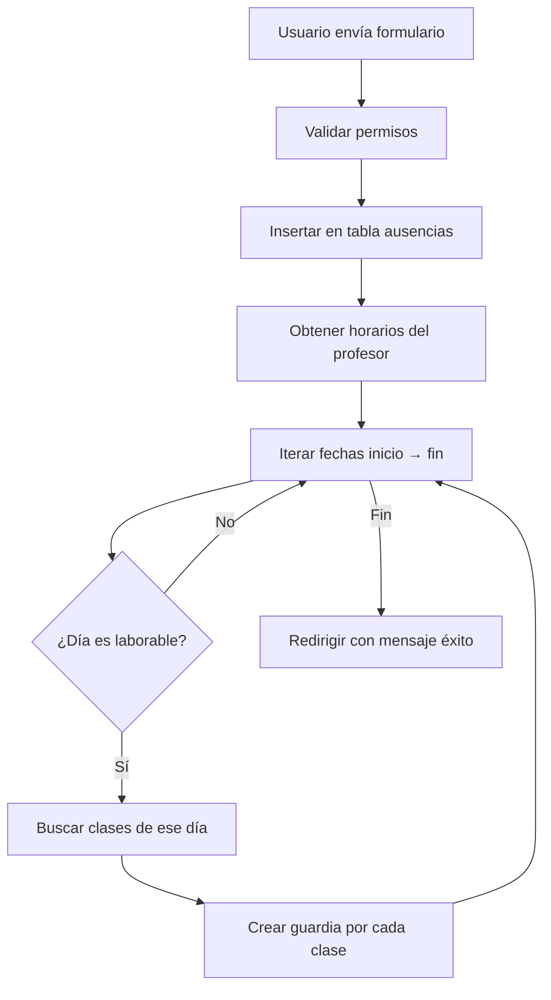

# 📘 Guía Técnica del Sistema Guardianes

## Índice
1. [Arquitectura General](#1-arquitectura-general)
2. [Flujo de Conexión a Base de Datos](#2-flujo-de-conexión-a-base-de-datos)
3. [Flujo de Autenticación (Login)](#3-flujo-de-autenticación-login)
4. [Sistema de Sesiones](#4-sistema-de-sesiones)
5. [Gestión de Profesores](#5-gestión-de-profesores)
6. [Gestión de Ausencias](#6-gestión-de-ausencias)
7. [Sistema de Guardias](#7-sistema-de-guardias)
8. [API de Asignación de Guardias](#8-api-de-asignación-de-guardias)
9. [Horarios de Profesores](#9-horarios-de-profesores)

---

## 1. Arquitectura General

### Estructura de Archivos

```
Guardianes/
├── config.php              # Configuración de base de datos
├── conexion.php            # Conexión PDO
├── index.php               # Página de login
├── dashboard.php           # Panel principal
├── profesores.php          # Gestión de profesores
├── ausencias.php           # Gestión de ausencias
├── guardias.php            # Gestión de guardias
├── horario_profesor.php    # Horarios individuales
├── logout.php              # Cerrar sesión
├── includes/
│   ├── header.php          # Encabezado común
│   └── footer.php          # Pie de página común
└── api/
    ├── asignar_guardia.php # API para asignar guardias
    └── generar_guardias.php # API para sugerir profesores
```

### Flujo General de una Página

```mermaid
graph TD
    A[Usuario accede a página] --> B[session_start]
    B --> C{¿Existe $_SESSION['user_id']?}
    C -->|No| D[Redirigir a index.php]
    C -->|Sí| E[require_once conexion.php]
    E --> F[Consultas a BD con $pdo]
    F --> G[include header.php]
    G --> H[Renderizar contenido HTML/PHP]
    H --> I[include footer.php]
```

---

## 2. Flujo de Conexión a Base de Datos

### Paso 1: Definir Credenciales ([config.php](file:///c:/xampp/htdocs/Guardianes/config.php))

```php
<?php
define('DB_HOST', 'localhost');
define('DB_USER', 'root');
define('DB_PASS', '');
define('DB_NAME', 'guardianes');
?>
```

**¿Qué sucede?**
- Se crean 4 constantes globales con `define()`
- Estas constantes no pueden cambiar durante la ejecución
- Son accesibles desde cualquier archivo que las importe

### Paso 2: Crear Conexión PDO ([conexion.php](file:///c:/xampp/htdocs/Guardianes/conexion.php))

```php
<?php
require_once 'config.php';

try {
    $dsn = "mysql:host=" . DB_HOST . ";dbname=" . DB_NAME . ";charset=utf8mb4";
    
    $options = [
        PDO::ATTR_ERRMODE => PDO::ERRMODE_EXCEPTION,
        PDO::ATTR_DEFAULT_FETCH_MODE => PDO::FETCH_ASSOC,
        PDO::ATTR_EMULATE_PREPARES => false,
    ];
    
    $pdo = new PDO($dsn, DB_USER, DB_PASS, $options);
    
} catch (\PDOException $e) {
    throw new \PDOException($e->getMessage(), (int)$e->getCode());
}
?>
```

**Flujo de ejecución:**

1. `require_once 'config.php'` → Importa las constantes DB_HOST, DB_USER, etc.
2. Se construye el DSN (Data Source Name): `"mysql:host=localhost;dbname=guardianes;charset=utf8mb4"`
3. Se configura el array de opciones:
   - `ERRMODE_EXCEPTION`: Convierte errores SQL en excepciones PHP
   - `FETCH_ASSOC`: Los resultados serán arrays asociativos `['columna' => 'valor']`
   - `EMULATE_PREPARES = false`: Usa prepared statements nativos de MySQL
4. Se crea el objeto `$pdo` con `new PDO()`
5. Si hay error, se lanza una excepción

**Resultado:** Variable global `$pdo` disponible para usar en cualquier archivo que haga `require_once 'conexion.php'`

---

## 3. Flujo de Autenticación (Login)

### Archivo: [index.php](file:///c:/xampp/htdocs/Guardianes/index.php)

#### Paso 1: Iniciar Sesión

```php
<?php
session_start();
```

**¿Qué hace?**
- Crea o recupera una sesión única para el navegador del usuario
- Genera/lee una cookie con un ID de sesión (PHPSESSID)
- Permite usar el array superglobal `$_SESSION`

#### Paso 2: Verificar si Ya Está Logueado

```php
if (isset($_SESSION['user_id'])) {
    header("Location: dashboard.php");
    exit;
}
```

**Flujo:**
- Si `$_SESSION['user_id']` existe → el usuario ya inició sesión
- Redirige automáticamente al dashboard
- `exit` detiene la ejecución del resto del código

#### Paso 3: Procesar Formulario de Login

```php
if ($_SERVER['REQUEST_METHOD'] == 'POST') {
    $email = $_POST['email'];
    $password = $_POST['password'];
    
    $stmt = $pdo->prepare("SELECT * FROM profesores WHERE email = ? AND estado = 'activo'");
    $stmt->execute([$email]);
    $user = $stmt->fetch();
    
    if ($user && password_verify($password, $user['password'])) {
        $_SESSION['user_id'] = $user['id'];
        $_SESSION['user_name'] = $user['nombre'] . ' ' . $user['apellidos'];
        $_SESSION['user_role'] = $user['rol'];
        
        header("Location: dashboard.php");
        exit;
    } else {
        $error = "Email o contraseña incorrectos.";
    }
}
```

**Flujo detallado:**

1. **Verificar método:** `$_SERVER['REQUEST_METHOD'] == 'POST'` → ¿Se envió el formulario?
2. **Obtener datos:** 
   - `$_POST['email']` viene del `<input name="email">`
   - `$_POST['password']` viene del `<input name="password">`
3. **Consultar BD:**
   - `prepare()` crea una consulta preparada (segura contra SQL injection)
   - `execute([$email])` reemplaza el `?` con el email
   - `fetch()` obtiene la primera fila como array asociativo
4. **Resultado de `$user`:**
   ```php
   $user = [
       'id' => 5,
       'nombre' => 'Juan',
       'apellidos' => 'Pérez',
       'email' => 'juan@example.com',
       'password' => '$2y$10$...',  // Hash bcrypt
       'rol' => 'admin',
       'departamento' => 'Matemáticas',
       'estado' => 'activo'
   ]
   ```
5. **Verificar contraseña:**
   - `password_verify($password, $user['password'])` compara la contraseña en texto plano con el hash
   - Devuelve `true` si coinciden
6. **Guardar en sesión:**
   - `$_SESSION['user_id'] = $user['id']` → Guarda el ID (5)
   - `$_SESSION['user_name'] = $user['nombre'] . ' ' . $user['apellidos']` → "Juan Pérez"
   - `$_SESSION['user_role'] = $user['rol']` → "admin"
7. **Redirigir:** `header("Location: dashboard.php")` + `exit`

---

## 4. Sistema de Sesiones

### Protección de Páginas Privadas

Todas las páginas privadas tienen este código al inicio:

```php
<?php
session_start();
if (!isset($_SESSION['user_id'])) {
    header("Location: index.php");
    exit;
}
require_once 'conexion.php';
```

**Flujo:**
1. `session_start()` → Recupera la sesión del usuario
2. `!isset($_SESSION['user_id'])` → ¿No existe user_id en la sesión?
3. Si no existe → redirige al login
4. Si existe → continúa y carga la conexión a BD

### Control de Acceso por Rol

```php
$is_admin = isset($_SESSION['user_role']) && $_SESSION['user_role'] === 'admin';

if ($is_admin) {
    // Código solo para administradores
}
```

**Ejemplo en HTML:**

```php
<?php if ($is_admin): ?>
    <button>Crear Profesor</button>
<?php else: ?>
    <p>No tienes permisos</p>
<?php endif; ?>
```

---

## 5. Gestión de Profesores

### Archivo: [profesores.php](file:///c:/xampp/htdocs/Guardianes/profesores.php)

#### Flujo de Creación de Profesor

```php
if ($_SERVER['REQUEST_METHOD'] == 'POST' && isset($_POST['add_teacher'])) {
    // Verificar que es admin
    if (!isset($_SESSION['user_role']) || $_SESSION['user_role'] !== 'admin') {
        die("Acceso denegado.");
    }
    
    $nombre = $_POST['nombre'];
    $apellidos = $_POST['apellidos'];
    $email = $_POST['email'];
    $password = password_hash($_POST['password'], PASSWORD_DEFAULT);
    $rol = $_POST['rol'];
    $departamento = $_POST['departamento'];
    
    $sql = "INSERT INTO profesores (nombre, apellidos, email, password, rol, departamento) 
            VALUES (?, ?, ?, ?, ?, ?)";
    $stmt = $pdo->prepare($sql);
    $stmt->execute([$nombre, $apellidos, $email, $password, $rol, $departamento]);
    
    header("Location: profesores.php");
    exit;
}
```

**Paso a paso:**

1. **Verificar envío:** `$_SERVER['REQUEST_METHOD'] == 'POST'` y `isset($_POST['add_teacher'])`
2. **Verificar permisos:** Solo admin puede crear profesores
3. **Obtener datos del formulario:** Cada `$_POST['campo']` corresponde a un `<input name="campo">`
4. **Hashear contraseña:** `password_hash()` convierte "123456" en "$2y$10$..."
5. **Insertar en BD:** Prepared statement con 6 parámetros
6. **Redirigir:** Vuelve a la misma página para ver el nuevo profesor

#### Listar Profesores

```php
$stmt = $pdo->query("SELECT * FROM profesores WHERE estado = 'activo' ORDER BY apellidos");
$profesores = $stmt->fetchAll();
```

**Resultado:**
```php
$profesores = [
    ['id' => 1, 'nombre' => 'Ana', 'apellidos' => 'García', ...],
    ['id' => 2, 'nombre' => 'Juan', 'apellidos' => 'Pérez', ...],
    // ...
]
```

**Renderizar en HTML:**

```php
<?php foreach ($profesores as $profesor): ?>
    <tr>
        <td><?php echo htmlspecialchars($profesor['nombre']); ?></td>
        <td><?php echo htmlspecialchars($profesor['apellidos']); ?></td>
        <td><?php echo htmlspecialchars($profesor['email']); ?></td>
    </tr>
<?php endforeach; ?>
```

---

## 6. Gestión de Ausencias

### Archivo: [ausencias.php](file:///c:/xampp/htdocs/Guardianes/ausencias.php)

#### Flujo Completo de Registro de Ausencia



#### Código Paso a Paso

**1. Recibir datos del formulario:**

```php
$profesor_id = $_POST['profesor_id'];
$fecha_inicio = $_POST['fecha_inicio'];  // "2024-11-28"
$fecha_fin = $_POST['fecha_fin'];        // "2024-11-30"
$motivo = $_POST['motivo'];
$tipo = $_POST['tipo'];
```

**2. Verificar permisos:**

```php
$is_admin = isset($_SESSION['user_role']) && $_SESSION['user_role'] === 'admin';
if (!$is_admin && $profesor_id != $_SESSION['user_id']) {
    die("Acceso denegado. Solo puedes registrar tus propias ausencias.");
}
```

**3. Insertar ausencia en BD:**

```php
$sql = "INSERT INTO ausencias (profesor_id, fecha_inicio, fecha_fin, motivo, tipo) 
        VALUES (?, ?, ?, ?, ?)";
$stmt = $pdo->prepare($sql);
$stmt->execute([$profesor_id, $fecha_inicio, $fecha_fin, $motivo, $tipo]);
```

**4. Obtener horarios del profesor:**

```php
$sql_horarios = "SELECT h.id, h.dia_semana, h.hora_inicio, h.hora_fin
                 FROM horario h
                 WHERE h.profesor_id = ? AND h.curso_escolar = '2024-2025'";
$stmt_horarios = $pdo->prepare($sql_horarios);
$stmt_horarios->execute([$profesor_id]);
$horarios = $stmt_horarios->fetchAll();
```

**Resultado:**
```php
$horarios = [
    ['id' => 10, 'dia_semana' => 'lunes', 'hora_inicio' => '08:00', 'hora_fin' => '09:00'],
    ['id' => 11, 'dia_semana' => 'lunes', 'hora_inicio' => '09:00', 'hora_fin' => '10:00'],
    ['id' => 12, 'dia_semana' => 'martes', 'hora_inicio' => '08:00', 'hora_fin' => '09:00'],
    // ...
]
```

**5. Generar guardias para cada día:**

```php
$fecha_actual = new DateTime($fecha_inicio);
$fecha_final = new DateTime($fecha_fin);

$dias_semana = [
    1 => 'lunes',
    2 => 'martes',
    3 => 'miercoles',
    4 => 'jueves',
    5 => 'viernes'
];

while ($fecha_actual <= $fecha_final) {
    $dia_num = (int)$fecha_actual->format('N'); // 1=Lunes, 5=Viernes
    
    if ($dia_num >= 1 && $dia_num <= 5) {
        $dia_nombre = $dias_semana[$dia_num];
        
        foreach ($horarios as $horario) {
            if ($horario['dia_semana'] == $dia_nombre) {
                $sql_guardia = "INSERT INTO guardias (horario_id, fecha, estado) 
                                VALUES (?, ?, 'pendiente')";
                $stmt_guardia = $pdo->prepare($sql_guardia);
                $stmt_guardia->execute([$horario['id'], $fecha_actual->format('Y-m-d')]);
            }
        }
    }
    
    $fecha_actual->modify('+1 day');
}
```

**Ejemplo de ejecución:**

Si el profesor tiene ausencia del 28/11 al 30/11 (jueves, viernes, sábado):

- **28/11 (jueves, día 4):**
  - Busca horarios con `dia_semana = 'jueves'`
  - Crea guardia para cada clase encontrada con `fecha = '2024-11-28'`
- **29/11 (viernes, día 5):**
  - Busca horarios con `dia_semana = 'viernes'`
  - Crea guardias
- **30/11 (sábado, día 6):**
  - `$dia_num = 6` → No cumple `>= 1 && <= 5`
  - Se salta (no se crean guardias)

---

## 7. Sistema de Guardias

### Archivo: [guardias.php](file:///c:/xampp/htdocs/Guardianes/guardias.php)

#### Consulta Principal

```php
$sql = "SELECT 
    g.id,
    g.fecha,
    g.estado,
    g.profesor_sustituto_id,
    h.dia_semana,
    h.hora_inicio,
    h.hora_fin,
    h.aula,
    h.modulo,
    p_ausente.nombre AS ausente_nombre,
    p_ausente.apellidos AS ausente_apellidos,
    p_asignado.nombre AS asignado_nombre,
    p_asignado.apellidos AS asignado_apellidos
FROM guardias g
JOIN horario h ON g.horario_id = h.id
JOIN profesores p_ausente ON h.profesor_id = p_ausente.id
LEFT JOIN profesores p_asignado ON g.profesor_sustituto_id = p_asignado.id
ORDER BY g.fecha DESC, h.hora_inicio ASC";

$stmt = $pdo->query($sql);
$guardias = $stmt->fetchAll();
```

**Explicación de JOINs:**

- `JOIN horario h ON g.horario_id = h.id` → Obtiene datos de la clase (día, hora, aula)
- `JOIN profesores p_ausente ON h.profesor_id = p_ausente.id` → Obtiene nombre del profesor ausente
- `LEFT JOIN profesores p_asignado ON g.profesor_sustituto_id = p_asignado.id` → Obtiene nombre del sustituto (puede ser NULL)

**Resultado:**
```php
$guardias = [
    [
        'id' => 1,
        'fecha' => '2024-11-28',
        'estado' => 'pendiente',
        'dia_semana' => 'jueves',
        'hora_inicio' => '08:00',
        'hora_fin' => '09:00',
        'aula' => '1A',
        'modulo' => 'Matemáticas',
        'ausente_nombre' => 'Juan',
        'ausente_apellidos' => 'Pérez',
        'asignado_nombre' => NULL,
        'asignado_apellidos' => NULL
    ],
    // ...
]
```

#### Renderizar Tabla

```php
<?php foreach ($guardias as $guardia): ?>
<tr>
    <td><?php echo date('d/m/Y', strtotime($guardia['fecha'])); ?></td>
    <td><?php echo ucfirst($guardia['dia_semana']); ?></td>
    <td><?php echo $guardia['hora_inicio'] . ' - ' . $guardia['hora_fin']; ?></td>
    <td><?php echo htmlspecialchars($guardia['aula']); ?></td>
    <td><?php echo htmlspecialchars($guardia['modulo']); ?></td>
    <td><?php echo htmlspecialchars($guardia['ausente_apellidos'] . ', ' . $guardia['ausente_nombre']); ?></td>
    <td>
        <?php if ($guardia['asignado_nombre']): ?>
            <?php echo htmlspecialchars($guardia['asignado_apellidos'] . ', ' . $guardia['asignado_nombre']); ?>
        <?php else: ?>
            <span style="color: #999;">Sin asignar</span>
        <?php endif; ?>
    </td>
    <td>
        <?php if ($is_admin): ?>
            <button onclick="generarGuardias(<?php echo $guardia['id']; ?>)">
                Asignar
            </button>
        <?php endif; ?>
    </td>
</tr>
<?php endforeach; ?>
```

---

## 8. API de Asignación de Guardias

### Archivo: [api/generar_guardias.php](file:///c:/xampp/htdocs/Guardianes/api/generar_guardias.php)

#### Flujo JavaScript → PHP

**1. Usuario hace clic en "Asignar":**

```javascript
function generarGuardias(guardiaId) {
    fetch(`api/generar_guardias.php?guardia_id=${guardiaId}`)
        .then(response => response.json())
        .then(data => {
            // Mostrar lista de profesores sugeridos
        });
}
```

**2. El navegador hace petición GET:**
```
GET /api/generar_guardias.php?guardia_id=5
```

**3. PHP recibe y procesa:**

```php
$guardia_id = $_GET['guardia_id'];

// Obtener datos de la guardia
$sql = "SELECT g.*, h.dia_semana, h.hora_inicio, h.hora_fin, h.modulo, h.profesor_id
        FROM guardias g
        JOIN horario h ON g.horario_id = h.id
        WHERE g.id = ?";
$stmt = $pdo->prepare($sql);
$stmt->execute([$guardia_id]);
$guardia = $stmt->fetch();
```

**4. Buscar profesores disponibles:**

```php
$sql_profesores = "SELECT DISTINCT p.id, p.nombre, p.apellidos, p.departamento
                   FROM profesores p
                   WHERE p.id != ? AND p.estado = 'activo'";
$stmt_profesores = $pdo->prepare($sql_profesores);
$stmt_profesores->execute([$guardia['profesor_id']]);
$profesores = $stmt_profesores->fetchAll();
```

**5. Calcular disponibilidad de cada profesor:**

```php
$suggestions = [];

foreach ($profesores as $profesor) {
    // Verificar si tiene clase a esa hora
    $sql_ocupado = "SELECT COUNT(*) FROM horario 
                    WHERE profesor_id = ? 
                    AND dia_semana = ? 
                    AND hora_inicio = ?";
    $stmt_ocupado = $pdo->prepare($sql_ocupado);
    $stmt_ocupado->execute([$profesor['id'], $guardia['dia_semana'], $guardia['hora_inicio']]);
    $tiene_clase = $stmt_ocupado->fetchColumn() > 0;
    
    // Contar guardias asignadas
    $sql_guardias = "SELECT COUNT(*) FROM guardias 
                     WHERE profesor_sustituto_id = ? 
                     AND fecha >= DATE_SUB(CURDATE(), INTERVAL 30 DAY)";
    $stmt_guardias = $pdo->prepare($sql_guardias);
    $stmt_guardias->execute([$profesor['id']]);
    $guardias_count = $stmt_guardias->fetchColumn();
    
    // Calcular puntuación
    $priority_score = 100 - $guardias_count;
    
    $suggestions[] = [
        'id' => $profesor['id'],
        'nombre' => $profesor['nombre'],
        'apellidos' => $profesor['apellidos'],
        'departamento' => $profesor['departamento'],
        'available' => !$tiene_clase,
        'guardias_count' => $guardias_count,
        'priority_score' => $priority_score,
        'qualified' => ($profesor['departamento'] == $guardia_departamento) ? 'same' : 'none'
    ];
}
```

**6. Ordenar y devolver JSON:**

```php
usort($suggestions, function($a, $b) {
    if ($a['available'] != $b['available']) {
        return $b['available'] - $a['available'];
    }
    return $b['priority_score'] - $a['priority_score'];
});

header('Content-Type: application/json');
echo json_encode(['suggestions' => $suggestions]);
```

**Respuesta JSON:**
```json
{
  "suggestions": [
    {
      "id": 3,
      "nombre": "María",
      "apellidos": "López",
      "departamento": "Matemáticas",
      "available": true,
      "guardias_count": 2,
      "priority_score": 98,
      "qualified": "same"
    },
    {
      "id": 5,
      "nombre": "Carlos",
      "apellidos": "Ruiz",
      "departamento": "Física",
      "available": true,
      "guardias_count": 5,
      "priority_score": 95,
      "qualified": "none"
    }
  ]
}
```

### Archivo: [api/asignar_guardia.php](file:///c:/xampp/htdocs/Guardianes/api/asignar_guardia.php)

**1. JavaScript envía petición POST:**

```javascript
function asignarGuardia(profesorId, profesorNombre) {
    fetch('api/asignar_guardia.php', {
        method: 'POST',
        headers: { 'Content-Type': 'application/json' },
        body: JSON.stringify({
            guardia_id: currentGuardiaId,
            profesor_id: profesorId
        })
    })
    .then(response => response.json())
    .then(data => {
        if (data.success) {
            location.reload();
        }
    });
}
```

**2. PHP recibe y procesa:**

```php
$data = json_decode(file_get_contents('php://input'), true);
$guardia_id = $data['guardia_id'];
$profesor_id = $data['profesor_id'];

// Verificar que es admin
if ($_SESSION['user_role'] !== 'admin') {
    http_response_code(403);
    echo json_encode(['error' => 'Acceso denegado']);
    exit;
}

// Actualizar guardia
$sql = "UPDATE guardias 
        SET profesor_sustituto_id = ?, estado = 'asignada' 
        WHERE id = ?";
$stmt = $pdo->prepare($sql);
$stmt->execute([$profesor_id, $guardia_id]);

echo json_encode(['success' => true]);
```

---

## 9. Horarios de Profesores

### Archivo: [horario_profesor.php](file:///c:/xampp/htdocs/Guardianes/horario_profesor.php)

#### Consulta de Horario

```php
$profesor_id = $_SESSION['user_id'];

$sql = "SELECT dia_semana, hora_inicio, hora_fin, aula, modulo, grupo
        FROM horario
        WHERE profesor_id = ? AND curso_escolar = '2024-2025'
        ORDER BY 
            FIELD(dia_semana, 'lunes', 'martes', 'miercoles', 'jueves', 'viernes'),
            hora_inicio";
$stmt = $pdo->prepare($sql);
$stmt->execute([$profesor_id]);
$horarios = $stmt->fetchAll();
```

**Explicación:**
- `FIELD(dia_semana, ...)` ordena los días en orden lunes→viernes
- `hora_inicio` ordena por hora dentro de cada día

**Resultado:**
```php
$horarios = [
    ['dia_semana' => 'lunes', 'hora_inicio' => '08:00', 'hora_fin' => '09:00', 'aula' => '1A', 'modulo' => 'Matemáticas', 'grupo' => '1º ESO A'],
    ['dia_semana' => 'lunes', 'hora_inicio' => '09:00', 'hora_fin' => '10:00', 'aula' => '1B', 'modulo' => 'Álgebra', 'grupo' => '2º ESO B'],
    ['dia_semana' => 'martes', 'hora_inicio' => '08:00', 'hora_fin' => '09:00', 'aula' => '2A', 'modulo' => 'Geometría', 'grupo' => '3º ESO A'],
    // ...
]
```

#### Renderizar Horario en Tabla

```php
<table>
    <thead>
        <tr>
            <th>Día</th>
            <th>Horario</th>
            <th>Aula</th>
            <th>Módulo</th>
            <th>Grupo</th>
        </tr>
    </thead>
    <tbody>
        <?php foreach ($horarios as $horario): ?>
        <tr>
            <td><?php echo ucfirst($horario['dia_semana']); ?></td>
            <td><?php echo $horario['hora_inicio'] . ' - ' . $horario['hora_fin']; ?></td>
            <td><?php echo htmlspecialchars($horario['aula']); ?></td>
            <td><?php echo htmlspecialchars($horario['modulo']); ?></td>
            <td><?php echo htmlspecialchars($horario['grupo']); ?></td>
        </tr>
        <?php endforeach; ?>
    </tbody>
</table>
```

---

## Resumen de Flujos Clave

### 1. Login
```
Usuario → Formulario → $_POST → BD → Verificar password → $_SESSION → Dashboard
```

### 2. Crear Ausencia
```
Formulario → Insertar ausencia → Obtener horarios → Iterar fechas → Crear guardias → Redirigir
```

### 3. Asignar Guardia
```
Clic botón → JS fetch → generar_guardias.php → Calcular disponibilidad → JSON → Mostrar lista → 
Clic profesor → asignar_guardia.php → UPDATE guardia → Recargar página
```

### 4. Protección de Páginas
```
session_start() → Verificar $_SESSION['user_id'] → Si no existe → Login → Si existe → Continuar
```
